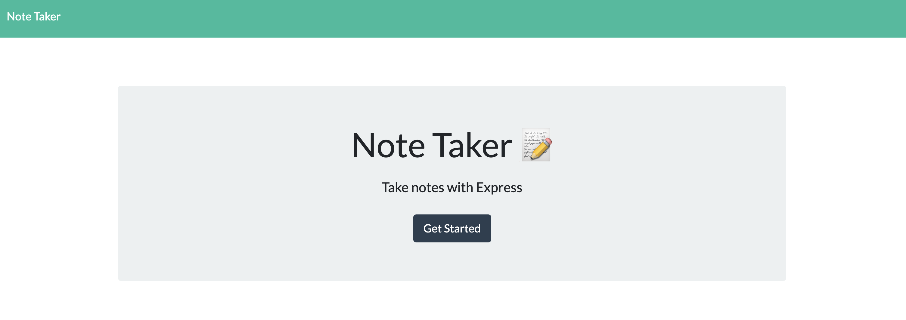
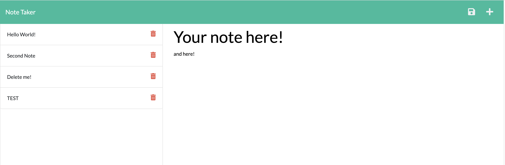

# NoteTaker App

## Table of Contents
* [Overview](#Overview)
* [Installation](#Installation)
* [Usage](#Usage)
* [License](#License) 

## Overview
This is the NoteTaker app. You can enter a note title with text, save it, retrieve it, and delete it.

## Installation
By going to the [deployment link](https://dudley-loon-78082.herokuapp.com/) you can go right to the app without needing to install anything.  This was coded using Express, UUID, and node/npm.

## Usage
This can be used to create a list of notes for the user. Once inputing a title and text, they can save their note by clicking on the disk image, and it will show up in a list on the left. The user can tap on a note to retrieve it, or hit the trash can to delete it. If they would like to create a new note, they must click the "+" plus button.

## License

            

    